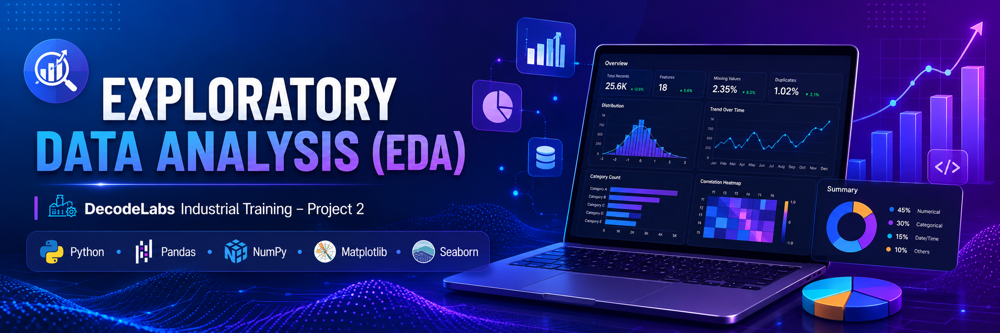
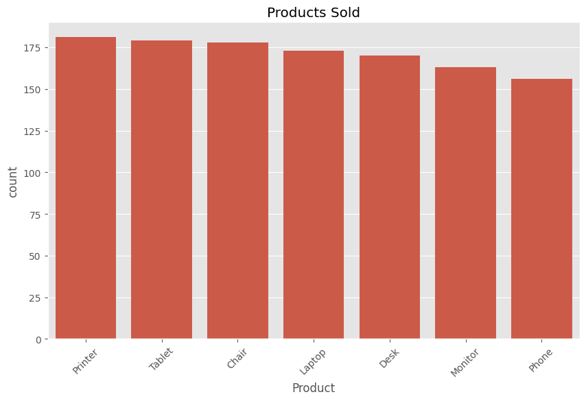
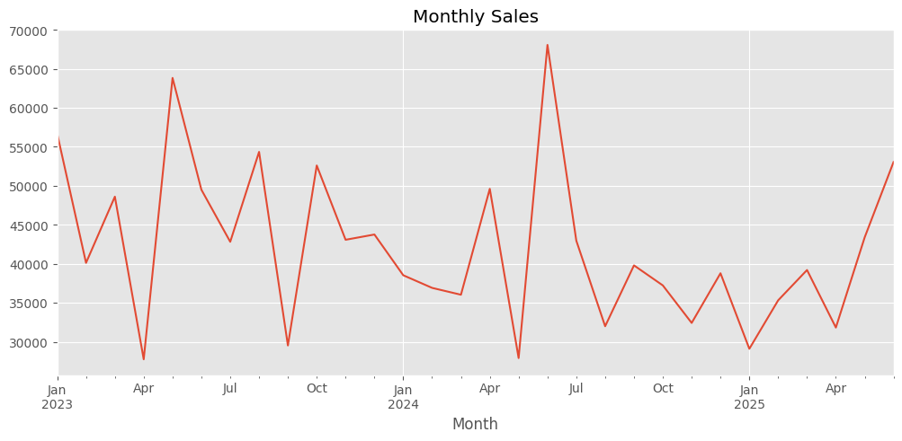
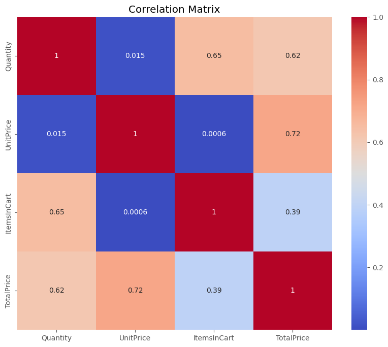
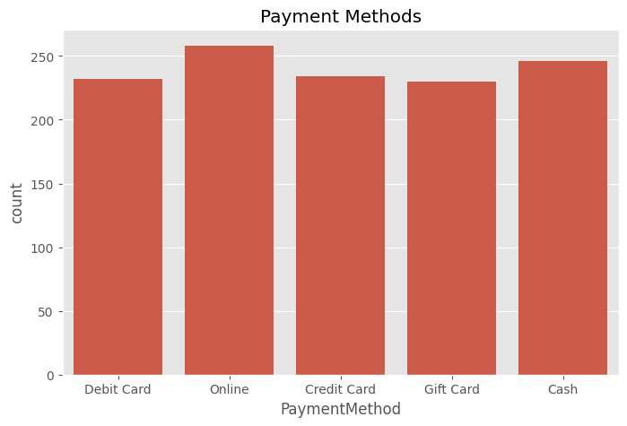
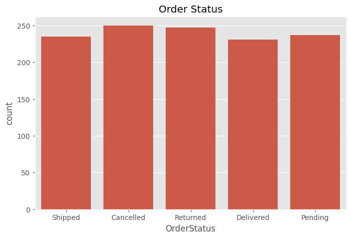
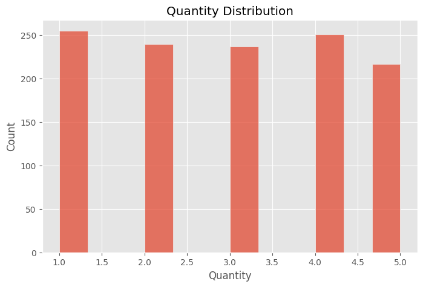
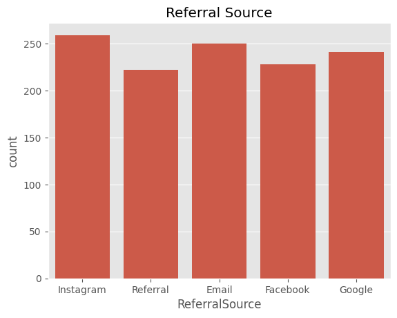

<!-- ========================= HERO BANNER ========================= -->

<p align="center">
  
</p>

<h1 align="center">📊 Exploratory Data Analysis (EDA)</h1>

<h3 align="center">DecodeLabs Industrial Training – Project 2</h3>

<p align="center">

</p>

---

# 🚀 Project Overview

This project performs **Exploratory Data Analysis (EDA)** on an **E-Commerce Sales Dataset** using Python.

The goal is to understand customer purchasing behavior, identify trends, analyze sales performance, detect outliers, and generate meaningful business insights through statistical analysis and data visualization.

---

# 🏆 Project Status


---

# 🛠 Tech Stack

<p align="center">


</p>

---

# 📊 Project Dashboard

| KPI | Value |
|------|------:|
| 📦 Dataset Records | 1200 |
| 📋 Features | 14 |
| 📈 Visualizations | 10+ |
| 🧹 Missing Values | Removed |
| ♻ Duplicate Records | Removed |
| 📉 Correlation Analysis | Completed |
| 📦 Outlier Detection | Completed |
| 💡 Business Insights | Generated |

---

# 🎯 Objectives

- Clean and preprocess data
- Perform descriptive statistics
- Study customer purchasing behavior
- Analyze payment methods
- Identify sales trends
- Detect outliers
- Create professional visualizations
- Generate actionable business insights

---

# 📂 Dataset Information

| Attribute | Details |
|------------|---------|
| Dataset | E-Commerce Sales |
| Rows | 1200 |
| Columns | 14 |
| Format | Excel (.xlsx) |

### Features

- OrderID
- Date
- CustomerID
- Product
- Quantity
- UnitPrice
- ShippingAddress
- PaymentMethod
- OrderStatus
- TrackingNumber
- ItemsInCart
- CouponCode
- ReferralSource
- TotalPrice

---

# 🚀 Features

✅ Data Cleaning

✅ Missing Value Analysis

✅ Duplicate Detection

✅ Descriptive Statistics

✅ Product Analysis

✅ Payment Method Analysis

✅ Monthly Sales Trend

✅ Correlation Heatmap

✅ Outlier Detection

✅ Revenue Analysis

✅ Business Insights

---

# 📈 Visualizations

## Product Distribution

<p align="center">

</p>

---

## Monthly Sales Trend

<p align="center">

</p>

---

## Correlation Heatmap

<p align="center">

</p>

---

## Payment Methods

<p align="center">

</p>

---

## Order Status

<p align="center">

</p>

---

## Quantity Distribution

<p align="center">

</p>

---

## Referral Source

<p align="center">

</p>

---

# 💡 Key Business Insights

- 📈 High-demand products contribute significantly to overall revenue.
- 💳 Customers prefer specific payment methods over others.
- 📅 Sales fluctuate across different months.
- 📢 Referral channels influence customer acquisition.
- 📦 High-value transactions indicate premium purchasing behavior.
- 📊 Quantity and Total Price show a positive relationship.
- 📉 Outliers reveal bulk purchases and exceptional orders.

---

# 📁 Project Structure

```text
Exploratory-Data-Analysis-Ecommerce/
│
├── 📂 Dataset
│   └── Dataset for Data Analytics(1).xlsx
│
├── 📂 Notebook
│   └── EDA_Project2.ipynb
│
├── 📂 Images
│   ├── banner.png
│   ├── Product_distribution.png
│   ├── correlation_heatmap.png
│   ├── monthly_sales.png
│   ├── payment_methods.png
│   ├── order_status.png
│   ├── Quantity_distribution.png
│   └── Referral_source.png
│
├── 📂 Report
│   └── EDA_Report.pdf
│
├── README.md
├── requirements.txt
└── LICENSE
```

---

# ⚙ How to Run

Clone the repository

```bash
git clone https://github.com/ashwini-s2004/Exploratory-Data-Analysis-Ecommerce.git
```

Move into the project

```bash
cd Exploratory-Data-Analysis-Ecommerce
```

Install dependencies

```bash
pip install -r requirements.txt
```

Launch Jupyter Notebook

```bash
jupyter notebook
```

Open

```text
Notebook/EDA_Project2.ipynb
```

---

# 🔮 Future Improvements

- Interactive Plotly Dashboard
- Power BI Dashboard
- Customer Segmentation
- Sales Forecasting
- Machine Learning Models
- Business Intelligence Reports

---

# 📜 License

This project is licensed under the **MIT License**.

---

# 👨‍💻 Author

<p align="center">

## Ashwini Suresh Sabale

**Data Analytics Enthusiast**

DecodeLabs Industrial Training – Batch 2026

[](https://github.com/ashwini-s2004)

</p>

---

<p align="center">

⭐ **If you found this project helpful, please consider giving it a Star!** ⭐

</p>
